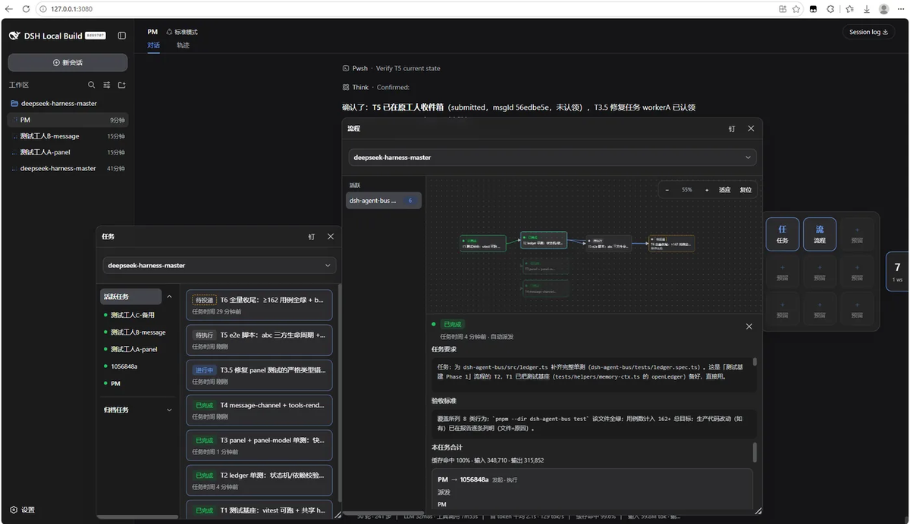
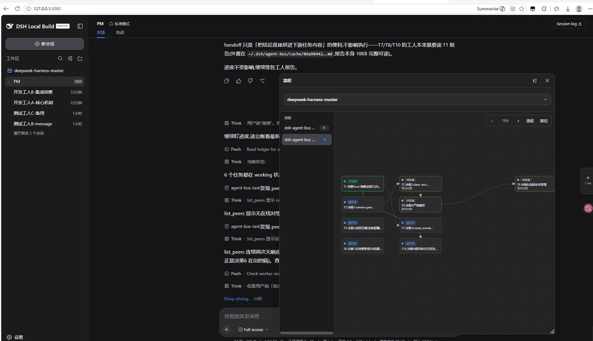

# dsh-agent-bus

[English](README.md) | **中文**

<p>
  <a href="https://github.com/MistyBridge/dsh-agent-bus/blob/main/LICENSE"></a>
  <a href="https://github.com/MistyBridge/dsh-agent-bus"></a>
  <a href="https://nodejs.org/"></a>
</p>

# DeepSeek Harness 上的多 Agent 编排

**把一屋子互不相干的 Agent 变成一支真正干活的团队。** 在同一条你已经在用的 Inbox 上派活、验收、按 DAG 跑多步骤流程——不用在它们之间复制粘贴，也不用守着循环当保姆。

> dsh-agent-bus 是 [DeepSeek Harness](https://github.com/deepseek-ai/deepseek-harness) 插件：给同一工作区的活跃会话配一份**持久任务台账**、条**验收回路**和一台 **DAG 调度器**——于是**协调这件事交给 Agent 自己**，而不是你。



*任务工作台：每件工作的状态、成员与消耗一目了然。*



*流程(DAG)看板：流程的节点，只在全部前置结算后投递。*

---

## 为什么值得做

Harness 已经能在同一个工作区里开多个 Agent，但它不让它们**协作**。落到实上：你才是那个粘合剂。

- **规划 Agent 没法把 brief 交给编码 Agent。** 你得手动贴过去。
- **编码 Agent 没法等验收 Agent。** 你得把 patch 贴过去，再催验收人。
- **第 3 步失败时，** 你得从聊天记录里把第 1、2 步重新拼回来，再手动重排后续。

agent-bus 把 **你** 从这个循环里摘出去：让协调变得**可持久、可验收、可自动**——这正是它能在生产里用起来、而不是停留在「聊天式演示」的原因。

### 你能得到什么

| 能力 | 你不用再做的事 |
|---|---|
| **真正的工作项，不是消息** | `create_task` 是一件带正文、带验收标准、带验收人的活；`send_note` 只是没有生命周期的问候。把任务当聊天，活会卡在「进行中」；把聊天当任务，验收就没了。 |
| **能自己跑的计划** | `create_flow` 建一张命名 DAG：每个任务**只在全部前置结算后**投递。终态失败沿链条传播——不会留下空转的执行者。 |
| **一份持久任务日志** | 每件活都是台账里的一行，不是埋在聊天里。`get_task` 读一件任务的完整一生；长报告落盘，绝不走模型可能泄露的路径。 |
| **真正会验收的验收人** | 执行方 report，验收方通过或把**同一条**任务连同意见打回去。重做全程同一个 id。 |
| **自己会走的上下文** | 结算后，执行方附一份交接（数值、决策、注意事项）随下游任务一起投递。下一棒读的是链条，不是考古。 |
| **能扛崩溃的记忆** | 台账 + Inbox 检查点在重启后存活；插件自动唤醒滞留执行者并恢复完整工具集。不用任何人把人拉回来。 |
| **真·专家而非子代理** | 每个总线成员都是普通 dsh 会话，自带独立的 skills、MCP 服务器、权限预设和模型。`create_member` 一键入职完整成员，失败自动回滚。 |

## 生产里能落在哪些地方

agent-bus 是为已超出「一个 Agent + 大量复制粘贴」的团队准备的：

- **长期多步骤构建**——规划一次发布，拆成 Agent 真去执行的任务，让 DAG 只在依赖被验收后才派下一步。你看面板，不看逐字稿。
- **能力各异专家池**——带仓库 MCP 的编码员、带网页 MCP 的研究员、权限更紧的验收人。各自保留配置，总线负责在他们之间路由活。
- **可复现的验收门槛**——每件活都有验收标准和验收人。非得一位具名验收人落定，才算「完成」。这是聊天与工作流的分水岭。
- **可查询的审计轨迹**——每个决定、结论、交接都是台账行或落盘报告。「昨天验收通过的是哪件？」是一次 `get_task`，不是翻聊天。
- **能活过重启的团队**——会话压缩和进程重启不会丢计划、不会困住执行者。总线会自动把它们拉起来。

## 怎么工作

投递用的是 harness Inbox：一个 turn 一条 `followup()`，空闲会话接下一条。本插件**不加第二队列**。

插件的活是 **台账**——谁派活、谁执行、什么叫「完成」、谁依赖谁——再加一台读台账的面板。

没有 receive 端工具。执行方看到的是一次普通 turn，干完调 `report_task`。

```
note     send_note              →  对方用 prose 回（或不回）
task     create_task            →  queued → submitted → working → completed → settle
flow     create_flow + tasks    →  DAG 在前置结算后自动投递下一节点
```

按轻重选最匹配的通道。

## Agent Bus vs 子代理

Harness 自带**子代理**：父会话调 `spawn_subagent`，子会话启动、干活、返回**摘要**。那是「孤立地探索一下再回来」的右工具。

我们**没有**把团队架在这套架构上。子代理会**继承父会话的权限组与配置**——skills、MCP 服务器、插件集、模型、白名单。你能裁剪工具带，但没法给编码员配仓库 MCP、给研究员配网页 MCP、给验收人配更紧的租户白名单——三者三种不同配置。精细分工正是专家团队需要的，而继承让这很难。

所以每个总线 Peer 都**是一个普通 DeepSeek Harness 会话**——你已经会定制的那种。它保留自己的 **skills**、**MCP 服务器**、**插件组**、**权限预设**、**模型**。

| | **子代理** | **Agent Bus** |
|---|---|---|
| 工作单元 | 为一件活而生的子会话，用完即弃 | `followup()` 进一个已存在的 Peer 会话 |
| 执行者*是*什么 | 一次性孩子：类型 + 能力模式 + 可选 persona | 你在 dsh 里配置的**一级会话实例** |
| Skills / MCP / 插件 | 继承，通常为 spawn 收窄 | **按会话**：自己的 skills、MCP 服务器、插件组 |
| 权限 | 父会话信封，收窄 | **按会话**（多租户 host 下按权限组） |
| 拓扑 | 星型：父是中心 | 同一工作区的 Peer + 持久台账 |
| 谁验收 | 父读摘要 | 一级验收人验收或重做**同一条**任务 id |
| 排序 | 父必须编排每一次 spawn | DAG：A 没结算，B 不投递 |
| 失败 | 父得自己发现 | 终态失败/取消沿链条传播 |
| 重启后 | 剧本活在父上下文里 | 台账 + Inbox 检查点存活 |
| 并行 | 一个父派多个孩子 | 多个 Peer 并行；每个 Peer 一个 turn 一个 Inbox 项 |

**经验法则：** 一次性的探索用子代理保护调用方上下文。当被调用者**是**一个具名队友——有自己的 skills、MCP、插件、权限、还会接下一条活——就用总线。

## 快速上手

```sh
dsh plugin --profile web add dsh-agent-bus
dsh web
```

本地开发：

```sh
dsh plugin --profile web add .
dsh --profile web --dump-config
dsh web
```

需要 Node.js `^22.19.0` 或 `>=24.0.0`（与 harness 一致；CI 跑在 Node 24）。

## 工具

| 你想… | 用 |
|---|---|
| 问一句、不是派活 | `send_note` |
| 给一个同伴一件要验收的活 | `create_task` |
| 按顺序跑一个多步骤计划 | `create_flow`，再带 `flow_id` / `dependencies` 的 `create_task` |
| 交差 / 验收 / 重做 / 停掉 / 反问 / 换人 | `report_task` · `settle_task` · `cancel_task` · `request_input` · `reassign_task` |
| 自己领回被重投的任务 | `claim_task` |
| 回答执行者的结构化提问 | `answer_question` |
| 把上下文交给下一棒 | `submit_handoff` |
| 改还没投递的节点，或查记录 | `edit_task` · `list_flows` · `list_tasks` · `get_task` |
| 给流程改名，让任务组更好管理 | `rename_flow` |
| 看谁在线，声明自己能做什么 | `list_peers` · `update_card` |
| 把新成员一键入职到工作区 | `create_member` |

## 文档

| | |
|---|---|
| [`docs/usage.md`](docs/usage.md) | 手册（中文）：工具、状态机、模板 |
| [`docs/v1.5-resilience-spec.md`](docs/v1.5-resilience-spec.md) | 离线消息、改派、离线宽限 |
| [`docs/v1.4-event-driven-scheduling-spec.md`](docs/v1.4-event-driven-scheduling-spec.md) | 事件驱动派发、流程、交接 |
| [`docs/a2a-alignment.md`](docs/a2a-alignment.md) | A2A 任务状态对齐 |

## 许可

MIT


**干活就是干活。** `create_task` 是一件有正文、可选验收标准、有验收人的工作。执行方 report；验收方通过，或把**同一条任务**连同修改意见打回去。重做全程同一个 id。

**计划可以在你不插手时往下跑。** `create_flow` 是一张命名 DAG。你（或规划 Agent）先写 plan，再按 `flow_id` 和 `dependencies` 拆任务。B 在 A 被验收之前根本不会投递。A 被取消或终态失败，B、C 跟着失败——不会留下还在空转的执行者。

**下一棒读到的是链条，不是考古。** 结算后，执行方可以给每个后向任务附交接（数值、决策、注意事项）。投递时拼进下游正文。第 3 棒不必靠 `get_task` 把第 1 棒翻出来。

**你看得到。** Web 界面右侧胶囊打开工作台：任务列表，以及按流程的 DAG 画布。点节点看全文要求。已归档的祖先留在图上，淡显。

## 任务日志

会话聊天不适合当工作台账。问候和任务混在一起，压缩上下文时会丢，下一棒也无法查询「昨天验收通过的是哪一件」。

Agent-bus 在对话旁边另有一份 **任务日志**：只记真正的工作，不是每条消息的全文转储。

**消息留在会话里。** `send_note` 是聊天。不落台账行、不上面板、不需要 report。那个会话的 jsonl **就是**它的记录。

**任务落台账行。** 每次 `create_task` 写下谁派的、谁做、谁验收、任务要求、可选验收标准、依赖，以及后来的判定。状态在这一行上走（`queued` → `submitted` → `working` → `completed` → settle）。重做是同一个 id；`get_task` 能读出一件活的完整一生。

**报告是文档，不是又一段聊天。** 短报告内联在行上。长报告按 task id 外置到磁盘——引用是 id，不是模型可能泄漏的路径：

| 区 | 位置 | 内容 |
|---|---|---|
| 热 | `~/.dsh/agent-bus/cache/` | 活跃任务报告；7 天未访问清理 |
| 冷 | `~/.dsh/agent-bus/archive/` | 终态任务（`completed` / `failed` / `canceled`）；30 天未访问清理 |

`get_task` 先热后冷。模型看不见分区。台账本身在 harness 存储域（`agent_bus`）；每次打开还会在 `~/.dsh/agent-bus/backups/` 写一份 JSON 快照（保留最近 20 份），避免 schema 重建把表吃掉。

**人看的和模型列的不一样。** 面板是给人的日志：活跃工作、归档（结算超过 24 小时，或失败/取消）、token、某个流程的 DAG。`list_tasks` 故意不列归档行——执行方收件箱不是历史堆。历史在面板、`get_task` 和会话日志里。

目的就这一条：下一棒、验收方、以及你，读的是**同一份**记录，而不是从三个聊天窗口里把活重新拼出来。

## 快速开始

```sh
dsh plugin --profile web add dsh-agent-bus
dsh web
```

本地开发：

```sh
dsh plugin --profile web add .
dsh --profile web --dump-config
dsh web
```

web-app bundle 已挂载存储和工作区注册表。自定义或 headless profile 须在自己的 `cordis.patch.yml` 里声明 `storage`、`storage-json`、`storage-domain`、`workspace`——否则加载即失败。记不住账的网关，不应以静默降级形态启动。

需要 Node.js `^22.19.0` 或 `>=24`。

## 它怎么工作

投递是 harness 的 Inbox：一次 `followup()` 一轮 turn，空闲会话才取下一项。本插件**不**再造一条队列。

插件负责的是**台账**——谁派的、谁做、什么叫完成、谁依赖谁——以及读这份台账的面板。

没有接收侧工具。执行方看到的是普通一轮对话。做完调用 `report_task`。

```
消息     send_note              →  对方用散文回复（也可以不回）
任务     create_task            →  queued → submitted → working → completed → settle
流程     create_flow + 任务     →  DAG 在前置结算后自动投递下一节点
```

选能覆盖需求的最轻通道。把聊天写成任务，工作会卡死在 `working`；把任务写成聊天，就丢掉验收。

## Agent Bus 对比 Sub-agent

### 为什么放弃 sub-agent 架构

Harness 已经有 **sub-agent**：父会话调用 `spawn_subagent`，子会话拉起来干活，交回一份**摘要**。适合「隔离着查一下再回来」。

团队没有建在这套架构上。子代理**通常继承主会话的权限组和配置**——skill、MCP、插件组、模型、allowlist。你可以裁工具带（agent 类型、capability mode、persona），但很难做到：编码会话自己的仓库 MCP、调研会话自己的网页 MCP、验收会话更严的租户 allowlist——三套不同的配置。专家团队要的就是这种精细化配置，继承做不到。

所以总线上的每一个对象**就是一个普通的 DeepSeek Harness 会话**——和你在 dsh 里已经会配的那种。它保住自己的 **skill**、**MCP**、**插件组**、**权限预设**和**模型**。组团队就是这么组的；多租户要挂的也是这套会话模型——**按租户 / 按角色的权限组与 dsh 插件组**，而不是「父会话这次 spawn 了什么」。

| | **Sub-agent** | **Agent Bus** |
|---|---|---|
| 工作单元 | 为这一次活新开子会话，结束即丢 | `followup()` 投进**已经存在**的同伴会话 |
| 执行方是什么 | 一次性孩子：类型 + capability mode + 可选 persona | 你在 dsh 里配好的**一等会话实例** |
| Skill / MCP / 插件 | 从父会话继承，spawn 时通常被裁 | **按会话**：自己的 skill、MCP、插件组 |
| 权限 | 父会话的信封再收窄 | **按会话**（多租户宿主上还可以按权限组） |
| 拓扑 | 星型：父会话是枢纽 | 同工作区 peer + 持久台账 |
| 谁验收 | 父会话读摘要 | 独立验收方，通过或把**同一 task id** 打回去重做 |
| 顺序 | 下一步必须由父会话再 spawn | DAG：A 结算之前 B 根本不会投递 |
| 失败 | 父会话得自己发现 | 终态失败 / 取消沿下游自动传播 |
| 进程重启 | 剧本在父会话上下文里 | 台账 + Inbox 检查点还在 |
| 并行 | 一个父会话可以同时挂很多子会话 | 多个 peer 同时干活；每个 peer 仍然一条一 turn |

### 成本实际花在哪

没有虚构的「快几倍」。差别是 **token 和延迟花在谁身上**。

| 成本 | Sub-agent | Agent Bus |
|---|---|---|
| **Prompt cache** | 每次 spawn 都付一遍**冷**前缀（系统提示、工具、指令）。 | 专家是长会话。下一件任务是同一前缀上的下一轮 user turn，**缓存是热的**。 |
| **编排者上下文** | 每个子会话的摘要都进**父窗口**。N 件活 → 父上下文按 N 份摘要涨。 | 发起方只收到一条短通知。全文在台账里（长报告落盘）。需要时再 `get_task`。 |
| **到首 token 的时间** | 拉起会话 + 冷缓存上的第一次解码。 | 同伴在线且空闲：就是**下一轮**，不新开进程。 |
| **专家记忆** | 子会话结束就没了。第 4 件活不记得第 3 件，除非父会话把摘要塞进下一次 spawn。 | 同一个编码会话窗口里还留着第 3 件活（工作区文件也还在）。其余靠交接文档。 |
| **一次性探索** | **用这个。** 隔离窗口，父会话缓存不被污染。 | 别用。peer 是团队里的人，不是沙箱。 |

**口诀：** 要保护调用方上下文、干完就扔 → spawn sub-agent。被叫的那一方**就是**一个有自己 skill / MCP / 插件 / 权限、还要接下一件活的同事 → 用 bus。

## 工具

| 你想… | 用 |
|---|---|
| 问一句、不是派活 | `send_note` |
| 给一个同伴一件要验收的活 | `create_task` |
| 按顺序跑一个多步骤计划 | `create_flow`，再带 `flow_id` / `dependencies` 的 `create_task` |
| 交差 / 验收 / 重做 / 停掉 / 反问 / 换人 | `report_task` · `settle_task` · `cancel_task` · `request_input` · `reassign_task` |
| 自己领回被重投的任务 | `claim_task` |
| 回答执行者的结构化提问 | `answer_question` |
| 把上下文交给下一棒 | `submit_handoff` |
| 改还没投递的节点，或查记录 | `edit_task` · `list_flows` · `list_tasks` · `get_task` |
| 给流程改名，让任务组更好管理 | `rename_flow` |
| 看谁在线，声明自己能做什么 | `list_peers` · `update_card` |
| 把新成员一键入职到工作区 | `create_member` |

## 文档

| | |
|---|---|
| [`docs/usage.md`](docs/usage.md) | 操作手册：工具、状态机、模板 |
| [`docs/v1.5-resilience-spec.md`](docs/v1.5-resilience-spec.md) | 离线消息、转派、离线宽限 |
| [`docs/v1.4-event-driven-scheduling-spec.md`](docs/v1.4-event-driven-scheduling-spec.md) | 事件驱动排期、流程、交接 |
| [`docs/a2a-alignment.md`](docs/a2a-alignment.md) | A2A 任务状态对齐 |

## License

MIT
